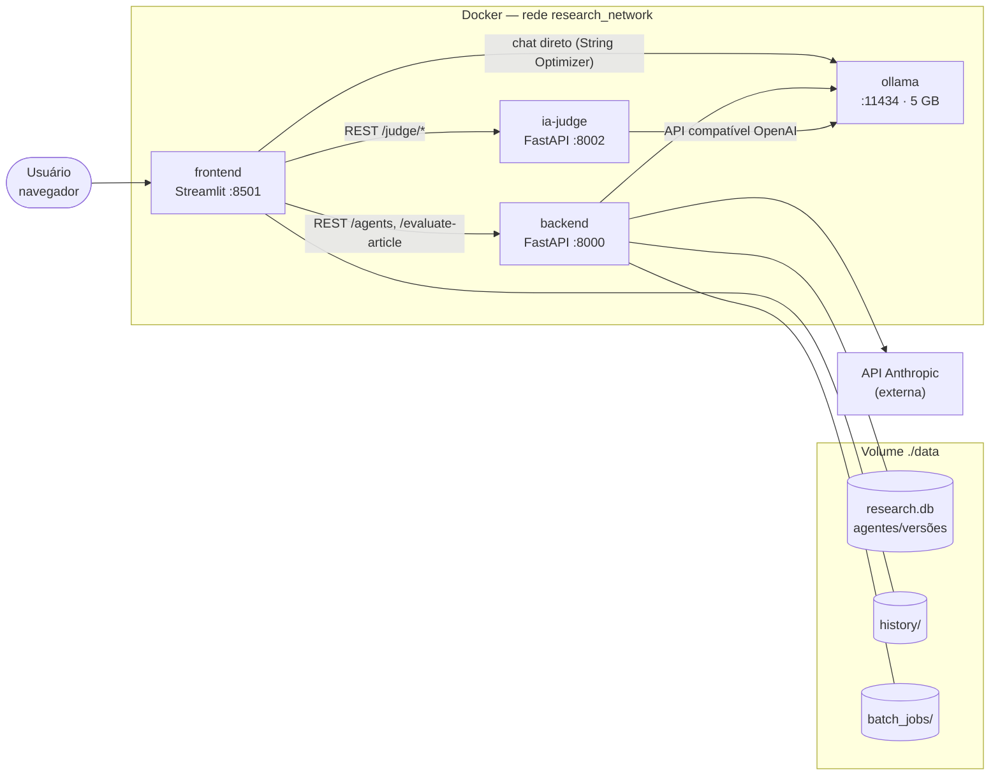
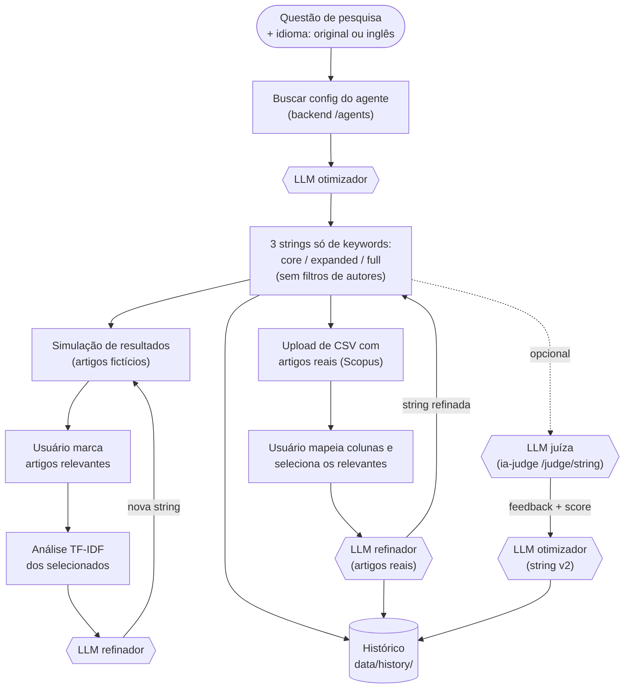
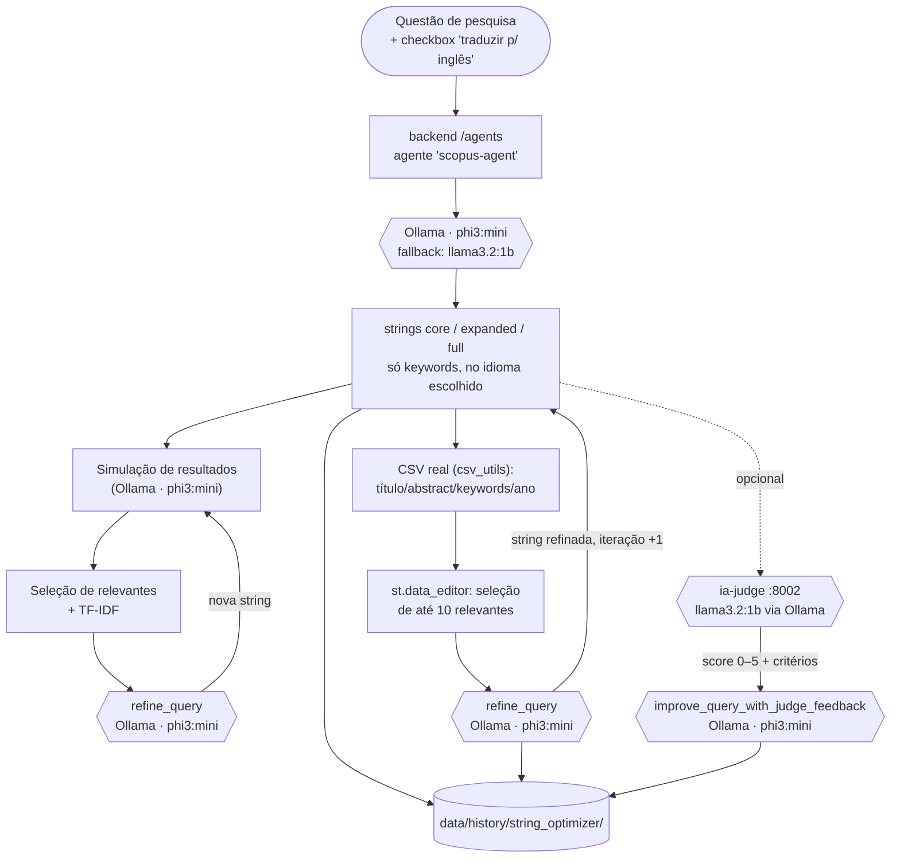
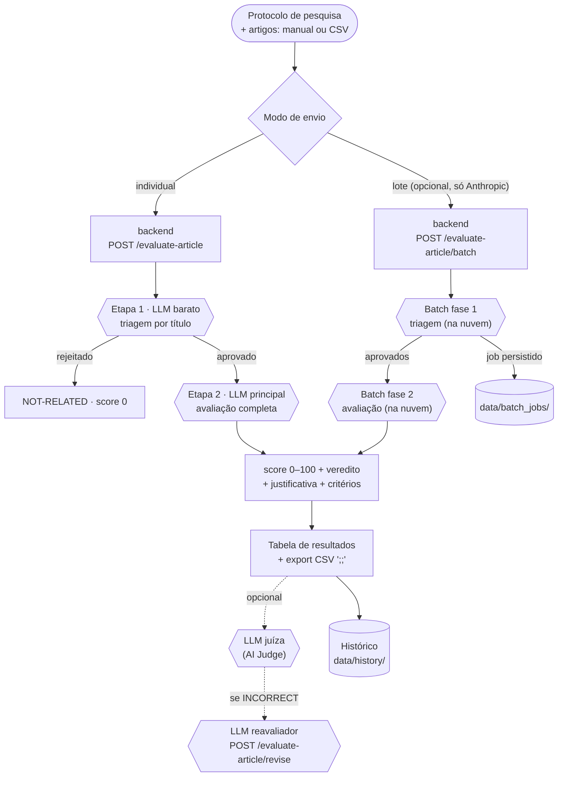
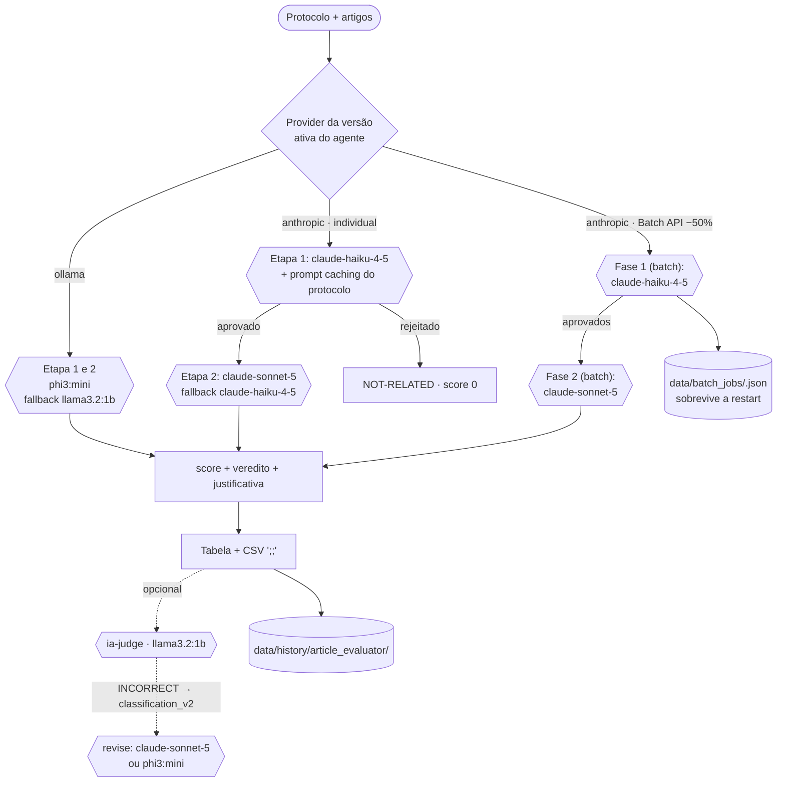
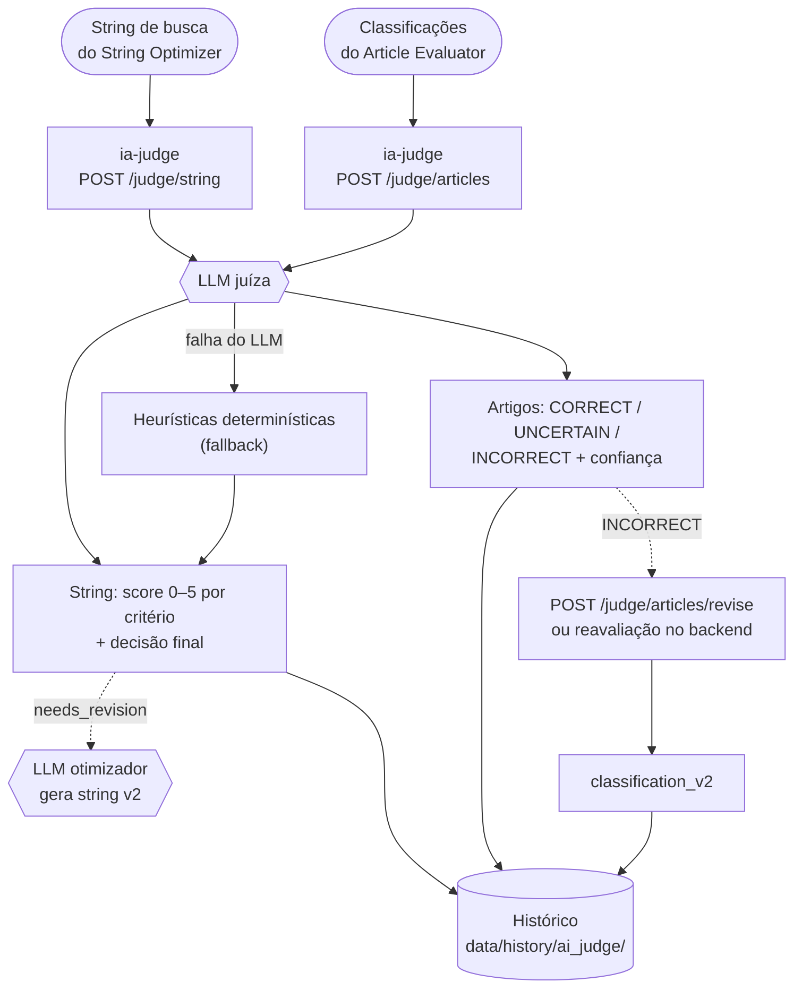
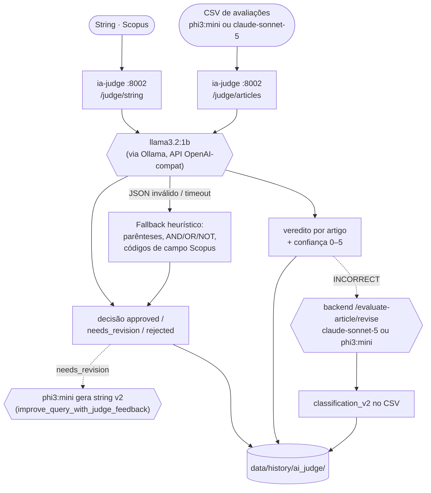

# Arquitetura do Sistema — UPE_AES_2026.1

Documento de referência da arquitetura da plataforma de apoio a Revisões Sistemáticas da Literatura (RSL).

> Os diagramas estão em **Mermaid** e renderizam como imagem no GitHub, no VS Code (preview de Markdown) e em https://mermaid.live. Cada feature tem duas versões do fluxo: uma **genérica** (papéis, sem citar modelos) e uma **com os modelos básicos** realmente configurados.

---

## 1. Arquitetura geral

O sistema é composto por **4 containers Docker** na rede `research_network`, orquestrados via `docker-compose.yml`, mais um provedor externo (API da Anthropic):

| Serviço | Tecnologia | Porta (host) | Papel |
|---|---|---|---|
| `frontend` | Streamlit | 8501 | Interface do usuário (multipage): Agentes, String Optimizer, Article Evaluator, AI Judge, Histórico |
| `backend` | FastAPI + SQLModel/SQLite | 8000 | CRUD de agentes/versões e avaliação de artigos (individual e em lote via Batch API) |
| `ia-judge` | FastAPI | 8002 | Serviço "IA como juíza": julga strings de busca e classificações de artigos |
| `ollama` | Ollama (limite 5 GB RAM) | 11434 | LLM local — `phi3:mini` (principal) e `llama3.2:1b` (fallback/juiz) |
| — | API Anthropic (externa) | — | Provedor alternativo de LLM: `claude-sonnet-5`, `claude-haiku-4-5` (individual, com prompt caching, e Batch API) |

> O container do **Chroma** (vector store) foi removido: as páginas que o usavam (Query Chroma / Upload PDF) já haviam sido descontinuadas. Quem atualizar de uma versão antiga deve rodar `docker compose up -d --remove-orphans` uma vez.

### Pontos-chave

- **Volume compartilhado `./data:/app/data`** entre `backend` e `frontend`. Nele ficam:
  - `research.db` — SQLite com agentes e versões (system prompt, modelos, temperatura, provider);
  - `history/` — histórico de execuções das três ferramentas (JSON + arquivos por registro);
  - `batch_jobs/` — estado persistido dos jobs da Batch API (sobrevive a reinícios de container);
  - `article_presets.json` — presets de protocolo de pesquisa.
- **Agentes versionados**: o backend guarda "agentes" com versões ativáveis. Cada versão define `system_prompt`, `model_primary`, `model_fallback`, `temperature` e `provider` (`ollama` ou `anthropic`). O frontend consulta `GET /agents` para saber qual configuração usar em cada ferramenta.
- **Dois provedores de LLM**: Ollama local (grátis, lento) e Anthropic (pago, rápido), escolhidos pelo campo `provider` da versão ativa do agente. Otimizações de custo no caminho Anthropic: modelo barato na triagem, prompt caching e Batch API (50% de desconto).
- **Resiliência**: todo fluxo tem fallback de modelo; erros retornam `detail` legível ao usuário; o histórico nunca quebra o fluxo principal (erros de persistência são apenas logados).

### Diagrama de containers

---

## 2. Arquitetura por feature

### 2.1 String Optimizer (`frontend/pages/2_String_Optimizer.py`)

**O que faz:** constrói strings de busca otimizadas para o Scopus a partir de uma questão de pesquisa, simula resultados e refina iterativamente com base nos artigos que o usuário marca como relevantes. Além da simulação, aceita um **CSV de artigos reais** (título, abstract, keywords, ano — ex.: export do Scopus): o usuário mapeia as colunas, seleciona os artigos relevantes numa tabela e o agente refina a string ativa para capturar melhor esse conjunto (até 10 artigos são enviados por refinamento, com abstracts truncados, para manter o prompt enxuto).

**Regras de geração da string:**
- As strings são construídas **apenas com keywords e sinônimos** — nunca incluem filtros de autores ou afiliação (`AU-ID`, `AUTHOR-NAME`, `AF-ID`). Os três níveis são: *core* (conceitos essenciais), *expanded* (+ sinônimos) e *full* (+ códigos de campo Scopus como `PUBYEAR`, `DOCTYPE`).
- **Idioma**: por padrão, keywords e strings saem **no mesmo idioma da questão de pesquisa**. Um checkbox na página ("🌐 Traduzir a string de busca para o inglês") permite gerar tudo em inglês; a escolha vale para a otimização, o refinamento e a string v2 pós-julgamento, e fica registrada no histórico.

**Particularidade arquitetural:** a lógica de LLM roda **no próprio frontend** (`frontend/scopus_agent.py`), chamando o Ollama diretamente — o backend participa apenas fornecendo a configuração do agente (`scopus-agent`: system prompt, modelos, temperatura). Isso mantém a iteração rápida e o estado (strings, seleções, TF-IDF) na sessão do Streamlit.

Componentes:

- `scopus_agent.py` — `optimize_query` (gera strings *core*, *expanded* e *full*), `simulate_results`, `refine_query` (refinamento a partir dos artigos selecionados), `improve_query_with_judge_feedback` (string v2 após julgamento). Todas com fallback de modelo, reparo de JSON (`json_repair`) e a instrução de idioma anexada à mensagem do usuário (assim ela vale mesmo com system prompts customizados vindos do backend).
- `text_analysis.py` — TF-IDF e pesos de termos sobre os artigos simulados, para apoiar o refinamento.
- `csv_utils.py` — leitura robusta de CSVs (detecção de separador/encoding, incluindo o export `;;` próprio) e serialização `;;`, compartilhado com o Article Evaluator.
- `ai_judge_client.py` — integração opcional com o serviço `ia-judge` (`POST /judge/string`) para avaliar a qualidade da string.
- `history_store.py` — registra otimizações e refinamentos em `data/history/string_optimizer/`.

#### Fluxo — versão genérica

#### Fluxo — versão com os modelos básicos

---

### 2.2 Article Evaluator (`frontend/pages/3_Article_Evaluator.py`)

**O que faz:** avalia artigos (título, abstract, palavras-chave, ano) contra um protocolo de pesquisa (descrição, objetivos, critérios de inclusão/exclusão), retornando score 0–100, veredito (`RELATED` / `UNSURE` / `NOT-RELATED`) e justificativa. Aceita entrada **manual** (1 artigo) ou **CSV em lote** (importação robusta com detecção de separador/encoding; exportação com separador `;;`).

**Particularidade arquitetural:** aqui a lógica de LLM roda **no backend**, que é *provider-agnostic*:

- `backend/agents/evaluation_core.py` — núcleo compartilhado: monta os prompts, orquestra a avaliação em **duas etapas** e normaliza a resposta. As etapas:
  1. **Triagem por título ("pente grosso")** — decisão binária barata: rejeita de cara artigos claramente fora do escopo;
  2. **Avaliação completa ("pente fino")** — só para os aprovados, com título + abstract + keywords + ano.
- `backend/agents/article_evaluator.py` — provider **Ollama**.
- `backend/agents/claude_article_evaluator.py` — provider **Anthropic**, com duas otimizações de custo: modelo barato dedicado à etapa 1 (`ANTHROPIC_MODEL_SCREENING`) e **prompt caching** (o protocolo de pesquisa vira prefixo cacheado; leituras custam ~10% do preço de input).
- `backend/agents/claude_batch_evaluator.py` — alternativa via **Batch API** da Anthropic (50% de desconto): duas fases de batch (triagem → pente fino dos aprovados), com estado persistido em `data/batch_jobs/<job_id>.json`. O processamento ocorre nos servidores da Anthropic, então **o container pode ficar desligado** durante a execução; os resultados ficam recuperáveis por 29 dias.
- Endpoints (`backend/routers/agents.py`): `POST /agents/evaluate-article` (individual), `POST/GET /agents/evaluate-article/batch` (lote assíncrono), `POST /agents/evaluate-article/revise` (reavaliação com feedback do juiz).

O resultado em lote alimenta a mesma tabela da interface, o julgamento pelo AI Judge, a exportação CSV `;;` e o histórico (`data/history/article_evaluator/`, que guarda protocolo, CSV de entrada e CSV de saída).

#### Fluxo — versão genérica

#### Fluxo — versão com os modelos básicos

---

### 2.3 AI Judge (`ia-judge/` + `frontend/pages/4_AI_Judge.py`)

**O que faz:** atua como uma "segunda opinião" automatizada (padrão *LLM-as-a-judge*) sobre os artefatos produzidos pelas outras ferramentas:

1. **Julgamento de string de busca** (`POST /judge/string`) — avalia a string em critérios (cobertura, precisão, sintaxe booleana, compatibilidade com a base) e devolve score final 0–5 + decisão (`approved` / `needs_revision` / `rejected`), com heurísticas determinísticas de fallback (parênteses balanceados, operadores booleanos, compatibilidade Scopus) caso o LLM falhe.
2. **Julgamento de classificações de artigos** (`POST /judge/articles`) — para cada avaliação do Article Evaluator, emite veredito `CORRECT` / `UNCERTAIN` / `INCORRECT`, confiança 0–5 e recomendação de revisão humana.
3. **Revisão de classificações** (`POST /judge/articles/revise`) — propõe uma `classification_v2` para os casos julgados incorretos.

**Particularidade arquitetural:** é um **microserviço FastAPI independente** (`ia-judge`, porta 8002), deliberadamente separado do backend para que o juiz use um LLM diferente do avaliador (evita o viés de "se autoavaliar"). Fala com o Ollama pela API compatível com OpenAI (`LLM_BASE_URL=http://ollama:11434/v1`, `LLM_MODEL=llama3.2:1b`). É consumido de três lugares: da página dedicada 4_AI_Judge, do String Optimizer (julgar string) e do Article Evaluator (julgar lote de classificações). Julgamentos são registrados em `data/history/ai_judge/`.

#### Fluxo — versão genérica

#### Fluxo — versão com os modelos básicos

---

## 3. Componentes de apoio

- **Agentes (`frontend/pages/1_Agents.py` + backend)** — gestão de agentes e versões (prompt, modelos, temperatura, provider), com ativação de versão. É o que permite trocar Ollama ↔ Anthropic sem alterar código.
- **Histórico (`frontend/pages/5_Historico.py` + `frontend/history_store.py`)** — três abas (String Optimizer, Article Evaluator, AI Judge) lendo `data/history/<ferramenta>/<id>/` (JSON do registro + arquivos, ex.: CSV de entrada/saída). Persistência em disco: sobrevive a reinícios.
- **Estilo (`frontend/ui.py` + `.streamlit/config.toml`)** — tema e CSS compartilhados entre as páginas.
- **Testes unitários (`tests/`)** — cobrem as funções puras dos módulos principais (`scopus_agent`: extração/normalização de JSON, construção de strings, regra de idioma; `csv_utils`: leitura/serialização `;;`; `evaluation_core`: normalização de avaliações, invariante de exclusão, construção de mensagens). Rodam no host: `pip install -r requirements.dev.txt && python -m pytest tests/`.
